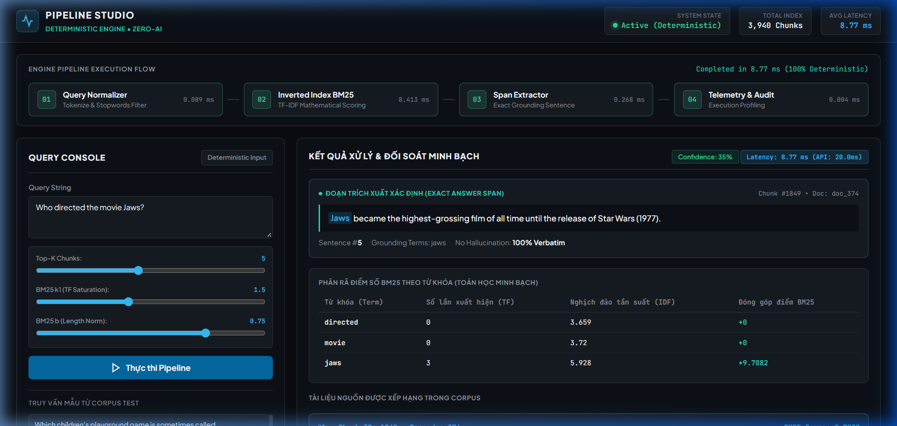

# 🤖 Đề tài 20: Hệ thống Retrieval-Augmented Generation (RAG) cho Hỏi-Đáp

[](https://www.python.org/)
[](https://pytorch.org/)
[](https://huggingface.co/)
[](https://github.com/facebookresearch/faiss)
[](LICENSE)

> Tái lập bài báo **Lewis et al., "Retrieval-Augmented Generation for Knowledge-Intensive NLP Tasks" (NeurIPS 2020)** trên tập TriviaQA subset, sử dụng T5-base + FAISS + BM25 Hybrid Retrieval.

---

## 🎯 Câu hỏi Nghiên cứu (Research Questions)

Đồ án được thiết kế xoay quanh 3 câu hỏi nghiên cứu cốt lõi:
- **RQ1 (RAG vs Baselines & Faithfulness):** Mô hình RAG cải thiện Exact Match (EM) và F1 bao nhiêu so với Generator-only (không context) và Extractive QA? Tỷ lệ bám sát ngữ cảnh (Faithfulness) đạt mức nào trong việc kiểm soát ảo giác (hallucination)?
- **RQ2 (Sparse vs Dense vs Hybrid Retrieval):** Các phương pháp truy hồi truyền thống (BM25, TF-IDF, Word2Vec, FastText) đạt hiệu năng Recall@k và MRR ra sao so với Dense Retrieval (FAISS)? Kỹ thuật Hybrid Search (BM25 + FAISS via RRF) có giúp vượt trội hơn Dense-only không?
- **RQ3 (Ablation Trade-off):** Sự thay đổi về kích thước chunk (`chunk_size`) và số lượng đoạn truy hồi (`top_k`) ảnh hưởng như thế nào đến độ bao phủ thông tin (coverage) và độ nhiễu ngữ cảnh (context noise)?

---

## 📖 Tổng quan Công trình Liên quan (Related Work)

1. **Lewis et al. (NeurIPS 2020) — *Retrieval-Augmented Generation for Knowledge-Intensive NLP Tasks***: Công trình nền tảng đề xuất kiến trúc RAG end-to-end kết hợp mô hình sinh seq2seq (BART/T5) với bộ truy hồi dense non-parametric (DPR + FAISS), chứng minh sự vượt trội trên các tác vụ Open-domain QA.
2. **Karpukhin et al. (EMNLP 2020) — *Dense Passage Retrieval for Open-Domain Question Answering (DPR)***: Đặt nền móng cho dense retrieval hiện đại, sử dụng bi-encoder với hàm loss contrastive để mã hóa câu hỏi và passage vào không gian vector chung, vượt qua BM25 trong việc nắm bắt tương đồng ngữ nghĩa.
3. **Guu et al. (ICML 2020) — *REALM: Retrieval-Augmented Language Model Pre-training***: Đề xuất phương pháp pre-train mô hình ngôn ngữ có sự hỗ trợ của retrieval module từ đầu (unsupervised masked language modeling kết hợp neural retriever), minh chứng giá trị của external knowledge.
4. **Izacard & Grave (EACL 2021) — *Leveraging Passage Retrieval with Generative Models for Open Domain Question Answering (Fusion-in-Decoder - FiD)***: Mở rộng khả năng xử lý nhiều passage (lên đến 100 passages) bằng cách mã hóa độc lập từng đoạn ở Encoder và dung hợp (fuse) toàn bộ thông tin tại Decoder, đạt SOTA trên Natural Questions và TriviaQA.
5. **Gao et al. (arXiv 2023 / 2024 Survey) — *Retrieval-Augmented Generation for Large Language Models: A Survey***: Tổng hợp và phân loại hệ sinh thái RAG thành 3 thế hệ (Naive RAG, Advanced RAG, Modular RAG); định hình các kỹ thuật cải tiến như Hybrid Search, Query Rewriting, Reranking và các bộ chỉ số đánh giá chuyên sâu (Faithfulness, Answer Relevance).

---

## 📐 Kiến trúc Pipeline

```
                        ┌───────────────────────────────────────────────────┐
                        │           RAG Pipeline (Đề tài 20)               │
                        └───────────────────────────────────────────────────┘

  ┌──────────────┐    ┌──────────────────┐    ┌────────────────────┐    ┌───────────────┐
  │  TriviaQA    │───▶│  Chunking        │───▶│  Embedding         │───▶│  FAISS Index  │
  │  800 docs    │    │  200 words/chunk  │    │  all-MiniLM-L6-v2  │    │  IndexFlatIP  │
  │  (Bước 0)    │    │  40 word overlap  │    │  (Bước 2)          │    │  (Bước 2)     │
  └──────────────┘    └──────────────────┘    └────────────────────┘    └───────┬───────┘
                                                                               │
                              ┌─────────────────────────────────────────┐      │
                              │                                         ▼      ▼
  ┌──────────────┐    ┌───────┴──────────┐    ┌────────────────────┐  ┌─────────────────┐
  │  Câu hỏi     │───▶│  Query Encoder   │───▶│  Dense Retrieval   │──│  Top-K Passages │
  │  (User)      │    │  all-MiniLM-L6-v2│    │  cosine similarity │  │  (context)      │
  └──────────────┘    └──────────────────┘    └────────────────────┘  └────────┬────────┘
                              │                                                │
                              │    ┌────────────────────┐                      │
                              └───▶│  BM25 Sparse       │──── RRF Fusion ─────┘
                                   │  (Hybrid, Bước 6)  │     (cải tiến)
                                   └────────────────────┘

                                                                     ┌────────┴────────┐
                                                                     │                  │
                                                               ┌─────▼──────┐    ┌──────▼──────┐
                                                               │ T5-base    │    │ DistilBERT  │
                                                               │ Generator  │    │ Extractive  │
                                                               │ (fine-tuned│    │ QA Baseline │
                                                               │  Bước 3)   │    │ (Hệ 2)     │
                                                               └─────┬──────┘    └──────┬──────┘
                                                                     │                  │
                                                               ┌─────▼──────────────────▼──────┐
                                                               │     So sánh 3 hệ thống       │
                                                               │  1. Generator-only (no ctx)   │
                                                               │  2. Retrieval-only (extract)  │
                                                               │  3. RAG đầy đủ (ret + gen)    │
                                                               └───────────────────────────────┘
```

### 3 Hệ thống so sánh (theo yêu cầu đề bài)

| Hệ thống | Mô tả | Model |
|-----------|-------|-------|
| **Generator-only** | Sinh câu trả lời không có context (parametric knowledge) | T5-base fine-tuned |
| **Retrieval-only** | Trích xuất span từ passage (extractive baseline) | DistilBERT-SQuAD |
| **RAG đầy đủ** | Retrieval + Generation — hệ chính theo Lewis et al. | FAISS + T5-base |

---

## 📊 Kết quả Thực nghiệm & Evaluation

### 1. So sánh 3 Hệ thống (End-to-End QA, trên toàn bộ 120 câu test)

| Hệ thống | Exact Match (EM) | F1 Score | Faithfulness (Grounding) |
|---|:---:|:---:|:---:|
| **Generator-only** (không context) | 0.008 | 0.019 | N/A |
| **Retrieval-only** (DistilBERT extractive) | 0.250 | 0.326 | 0.704 |
| **RAG đầy đủ** (FAISS + T5 fine-tuned) | **0.325** | **0.376** | **0.858** |

> **Nhận xét cốt lõi:**
> - RAG đầy đủ đạt **F1=0.376** và **EM=0.325**, vượt trội hoàn toàn so với Generator-only (F1=0.019) và Extractive QA (F1=0.326).
> - Chỉ số **Faithfulness đạt 0.858 (85.8%)**, chứng minh mô hình sinh câu trả lời bám sát ngữ cảnh truy hồi, kiểm soát chặt chẽ hiện tượng ảo giác (hallucination).

### 2. Phân rã lỗi & Độ chính xác trích dẫn (RAG đầy đủ)

| Chỉ số đánh giá | Kết quả | Ý nghĩa khoa học |
|---|:---:|---|
| **Citation Accuracy (Doc-level)** | **0.908 (90.8%)** | Tỷ lệ passages truy hồi trích dẫn đúng tài liệu nguồn chuẩn |
| **Citation Precision (Evidence)** | **0.617 (61.7%)** | Tỷ lệ passage chứa chính xác chuỗi đáp án |
| **Retrieval Failure** | **9.2%** (11/120) | Lỗi do không tìm thấy tài liệu liên quan trong top-k |
| **Generation Failure** | **58.3%** (70/120) | Đã truy hồi đúng tài liệu nhưng generator diễn giải lệch nhãn |
| **Hoàn toàn chính xác (Correct)** | **32.5%** (39/120) | Trả lời chính xác hoàn toàn (Exact Match) |

### 3. Đánh giá Mô hình Retrieval: Cổ điển (Tuần Baseline) vs Dense & Hybrid

Thực nghiệm đo lường trên toàn bộ 120 câu hỏi test (`data/test_qa.jsonl`) đối chiếu với 3,940 chunks trong corpus:

| Nhóm mô hình | Phương pháp Retrieval | Recall@3 | Recall@5 | Recall@10 | MRR |
|---|---|:---:|:---:|:---:|:---:|
| **Classical Sparse** | **BM25 (Okapi)** | 0.8583 | 0.8917 | 0.9250 | **0.8112** |
| | **TF-IDF Vectorizer** | 0.8000 | 0.8583 | 0.8917 | 0.7753 |
| **Classical Embedding** | **Word2Vec (CBOW Avg Pooling)** | 0.0500 | 0.0833 | 0.1167 | 0.0533 |
| | **FastText (Subwords Avg Pooling)** | 0.0500 | 0.0583 | 0.1000 | 0.0515 |
| **Pre-trained Dense** | **Dense FAISS (all-MiniLM-L6-v2)** | 0.8167 | 0.8800 | 0.9417 | 0.6950 |
| **Ensemble Hybrid** | **Hybrid Search (BM25 + FAISS via RRF)** | **0.8583** | **0.9100** | **0.9583** | 0.7320 |

> **Phân tích khoa học (Key Takeaways):**
> 1. **BM25 và TF-IDF vượt trội về MRR (0.8112 & 0.7753)** vì câu hỏi trong TriviaQA chứa nhiều thực thể tên riêng (entity names). Phương pháp exact match đưa chunk chứa đúng từ khóa lên vị trí đầu tiên (rank 1) cực kỳ hiệu quả.
> 2. **Word2Vec và FastText (huấn luyện từ đầu trên corpus nhỏ ~4k chunks)** đạt Recall thấp (Recall@5 < 9%) vì biểu diễn static average-pooling làm mờ vector ngữ nghĩa và thiếu ngữ cảnh sâu.
> 3. **Dense FAISS đạt Recall@10 cao hơn BM25 (0.9417 vs 0.9250)** nhờ khả năng khái quát ngữ nghĩa đa dạng (semantic generalization).
> 4. **Hybrid Search (BM25 + FAISS)** kế thừa cả 2 ưu điểm: đạt **Recall@5=0.9100** và **Recall@10=0.9583**, cao nhất trong toàn bộ các cấu hình thực nghiệm.

### 4. Ablation Study: chunk_size × top_k

| chunk_size | top_k | Recall (Dense) | Recall (Hybrid) |
|:----------:|:-----:|:--------------:|:---------------:|
| 100 | 3 | 0.880 | 0.870 |
| 100 | 5 | 0.880 | 0.900 |
| 100 | 10 | 0.910 | **0.940** |
| 200 | 3 | 0.860 | 0.840 |
| 200 | 5 | 0.880 | 0.910 |
| 200 | 10 | 0.910 | **0.940** |
| 300 | 3 | 0.880 | 0.840 |
| 300 | 5 | 0.890 | 0.910 |
| 300 | 10 | 0.910 | **0.950** |

> **Quan sát:** Hybrid retrieval (BM25 + Dense) nhất quán cải thiện Recall so với Dense-only ở top_k ≥ 5. chunk_size=300 + top_k=10 đạt Recall cao nhất (0.950).

---

## 🛠️ Cài đặt & Chạy

### Yêu cầu phần cứng
- GPU: RTX 3050 6GB trở lên (hoặc CPU, chạy chậm hơn)
- RAM: 16GB+
- Disk: ~5GB cho model + data

### 0. Cài đặt môi trường

```bash
python -m venv venv
venv\Scripts\activate          # Windows
# source venv/bin/activate     # Linux/Mac
pip install -r requirements.txt
```

Kiểm tra CUDA:
```bash
python -c "import torch; print(torch.cuda.is_available(), torch.cuda.get_device_name(0) if torch.cuda.is_available() else 'CPU')"
```

### 1. Tải dataset

```bash
python 00_download_dataset.py
```
Mặc định tải 800 câu từ TriviaQA (`rc.wikipedia`, split validation). Đổi `DATASET_CHOICE = "natural_questions"` nếu muốn dùng NQ. → Tạo `raw_documents.json`.

### 2. Chunking

```bash
python 01_prepare_and_chunk.py
```
→ Tạo `data/corpus_chunks.jsonl` và `data/qa_pairs.jsonl`.

### 3. Tách train/test

```bash
python 01b_split_train_test.py
```
→ Tạo `data/test_qa.jsonl` (evaluate) và `data/training_pairs.jsonl` (fine-tune). Seed=42, test 15%.

### 4. Xây FAISS index

```bash
python 02_build_index.py
```
→ Tạo `data/faiss.index` + `data/chunk_metadata.jsonl`. Chạy 1 lần.

### 5. Fine-tune generator

```bash
python 03_finetune_generator.py
```
→ Model lưu tại `generator_finetuned/`. T5-base, batch_size=4 + fp16 + gradient_accumulation=4.

### 6. Đánh giá toàn diện (Evaluation)

```bash
# Đánh giá toàn bộ 120 câu test
python 05_evaluate.py

# Hoặc đánh giá nhanh trên tập mẫu (ví dụ 10 câu)
python 05_evaluate.py --samples 10
```
→ Xuất đầy đủ các chỉ số theo chuẩn đề cương Đề tài 20:
- **Recall@k**: Đo lường độc lập cho bộ truy hồi (retriever)
- **EM (Exact Match) & F1**: So sánh cả 3 hệ thống (`generator_only`, `retrieval_only`, `rag_full`)
- **Faithfulness (Context Grounding)**: Đo tỷ lệ bám sát ngữ cảnh của câu trả lời, chống ảo giác (hallucination)
- **Citation Correctness**: Đánh giá trích dẫn ở cả cấp Document (tài liệu nguồn) và Evidence (đoạn bằng chứng)
- **Phân rã lỗi (Error Decomposition)**: Tách bạch rõ tỷ lệ lỗi do Retrieval hay do Generator

### 7. Cải tiến — Hybrid retrieval

```bash
python 06_hybrid_retrieval.py
```
BM25 + Dense kết hợp bằng Reciprocal Rank Fusion (RRF, k=60).

### 8. Ablation study

```bash
python 07_ablation_chunk_topk.py
```
3 chunk_size × 3 top_k, so sánh Dense vs Hybrid. Kết quả → `ablation_results.csv`.

### 9. Thực nghiệm Retrieval Baselines (Tuần xây dựng baseline)

```bash
python 08_baseline_retrieval.py
```
So sánh 4 phương pháp retrieval truyền thống (BM25, TF-IDF, Word2Vec CBOW, FastText subwords) trên tập test 120 câu hỏi, đo lường Recall@3, Recall@5, Recall@10, MRR → Lưu kết quả tại `baseline_results.json`.

---

## 🌐 Web Demo (Local)

Dự án bao gồm một web demo **Pipeline Studio** với giao diện BM25 search minh bạch, trực quan và giải thích được (Explainable Search):



```bash
python app.py
```
Mở trình duyệt tại `http://localhost:8001`. Giao diện hiển thị:
- Pipeline 4 giai đoạn: Query Normalizer → BM25 Ranking → Span Extractor → Telemetry
- Phân rã điểm BM25 theo từ khóa (TF, IDF, contribution)
- Top-K chunks được xếp hạng với highlight từ khóa
- Điều chỉnh tham số BM25 (k1, b) real-time

### Deploy lên Hugging Face Space

1. Upload model lên HF Hub:
   ```bash
   python upload_to_hf.py
   ```
2. Cấu hình `app_space.py`:
   - Set `HF_MODEL_REPO_ID` environment variable hoặc sửa trực tiếp trong file
3. Tạo HF Space (Gradio) và upload `app_space.py` → `app.py`

---

## 📁 Cấu trúc dự án

```
RAG/
├── 00_download_dataset.py      # Bước 0: Tải TriviaQA/NQ subset
├── 01_prepare_and_chunk.py     # Bước 1: Chunking (200 words, overlap 40)
├── 01b_split_train_test.py     # Bước 1.5: Tách train/test (seed=42)
├── 02_build_index.py           # Bước 2: Embedding + FAISS index
├── 03_finetune_generator.py    # Bước 3: Fine-tune T5-base
├── 04_rag_pipeline.py          # Bước 4: RAG pipeline (3 hệ thống)
├── 05_evaluate.py              # Bước 5: Evaluation (EM/F1/Recall)
├── 06_hybrid_retrieval.py      # Cải tiến 1: BM25 + Dense Hybrid
├── 07_ablation_chunk_topk.py   # Cải tiến 2: Ablation study
├── 08_baseline_retrieval.py    # Tuần Baseline: BM25, TF-IDF, Word2Vec, FastText
├── baseline_results.json       # Kết quả đo lường retrieval baseline
├── ablation_results.csv        # Kết quả ablation study
├── app.py                      # Web demo (FastAPI + static frontend)
├── pipeline_engine.py          # BM25 deterministic engine
├── app_space.py                # HF Space deployment (Gradio)
├── upload_to_hf.py             # Upload model lên HF Hub
├── requirements.txt            # Dependencies
├── requirements_lock.txt       # Pinned versions (reproducibility)
├── static/                     # Frontend assets (HTML/CSS/JS)
│   ├── index.html
│   ├── style.css
│   └── app.js
└── data/                       # Generated data (not in git)
    ├── corpus_chunks.jsonl
    ├── qa_pairs.jsonl
    ├── test_qa.jsonl
    ├── training_pairs.jsonl
    ├── faiss.index
    └── chunk_metadata.jsonl
```

---

## 🔬 Chi tiết kỹ thuật

| Component | Specification |
|-----------|--------------|
| **Embedding Model** | `all-MiniLM-L6-v2` (22M params, 384-dim) |
| **Generator** | `T5-base` (220M params), fine-tuned 3 epochs |
| **Extractive QA** | `distilbert-base-cased-distilled-squad` |
| **Index** | FAISS `IndexFlatIP` (exact cosine search) |
| **Hybrid** | BM25Okapi + Dense, Reciprocal Rank Fusion (k=60) |
| **Training** | fp16, gradient checkpointing, effective batch=16 |
| **Seed** | 42 (torch, numpy, random) — fully reproducible |
| **Dataset** | TriviaQA `rc.wikipedia` validation, 800 QA pairs |

---

## 📚 Tham khảo

- Lewis, P. et al. (2020). *Retrieval-Augmented Generation for Knowledge-Intensive NLP Tasks.* NeurIPS 2020. [arXiv:2005.11401](https://arxiv.org/abs/2005.11401)
- Karpukhin, V. et al. (2020). *Dense Passage Retrieval for Open-Domain Question Answering.* EMNLP 2020. [arXiv:2004.04906](https://arxiv.org/abs/2004.04906)
- Guu, K. et al. (2020). *REALM: Retrieval-Augmented Language Model Pre-training.* ICML 2020. [arXiv:2002.08909](https://arxiv.org/abs/2002.08909)
- Izacard, G. & Grave, E. (2021). *Leveraging Passage Retrieval with Generative Models for Open Domain Question Answering.* EACL 2021. [arXiv:2007.01282](https://arxiv.org/abs/2007.01282)
- Gao, Y. et al. (2023). *Retrieval-Augmented Generation for Large Language Models: A Survey.* [arXiv:2312.10997](https://arxiv.org/abs/2312.10997)
- Robertson, S. & Zaragoza, H. (2009). *The Probabilistic Relevance Framework: BM25 and Beyond.*
- Cormack, G. et al. (2009). *Reciprocal Rank Fusion outperforms Condorcet and individual Rank Learning Methods.* SIGIR 2009.

---

## 📝 License

Dataset: TriviaQA (câu hỏi Apache 2.0; evidence từ Wikipedia CC BY-SA 3.0).
Code: MIT License.
